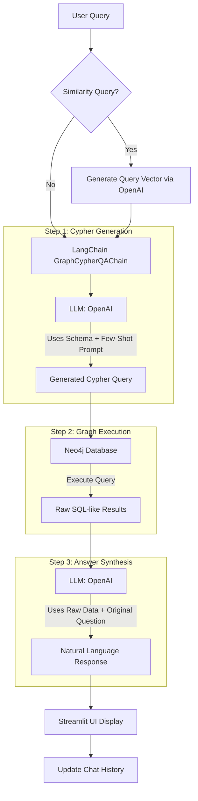

# Football KG Chatbot Working Documentation

This document explains the architecture and workflow of the **Football Knowledge Graph Chatbot** (`football_kg_chatbot.py`).

## 🛠 Tech Stack

The chatbot is built using a modern AI stack centered around GraphRAG (Graph Retrieval-Augmented Generation):

*   **UI/Frontend**: [Streamlit](https://streamlit.io/) - Provides the interactive chat interface and sidebar.
*   **Orchestration**: [LangChain](https://www.langchain.com/) - Specifically uses `GraphCypherQAChain` to bridge natural language and graph queries.
*   **Large Language Model (LLM)**: [OpenAI (GPT-3.5/4)](https://openai.com/) - Used for two tasks:
    1.  Translating natural language into **Cypher** (Neo4j's query language).
    2.  Synthesizing a human-like response from the graph data.
*   **Graph Database**: [Neo4j](https://neo4j.com/) - Stores football players, clubs, matches, and leagues as nodes and relationships.
*   **Embeddings**: [OpenAI Embeddings](https://platform.openai.com/docs/guides/embeddings) - Used for vector-based similarity searches (e.g., "players similar to Messi").

---

## 🔄 Workflow Diagram

Below is the step-by-step flow from a user query to a generated response:

---

## 📝 Detailed Execution Steps

### 1. Initialization
When the app starts, it connects to the Neo4j instance and initializes the `ChatOpenAI` model. It retrieves the **Database Schema** (Labels, Relationships, and Properties) which is crucial for the LLM to understand how to write valid Cypher.

### 2. User Input & Embedding Check
The user enters a question. The app checks if keywords like *"similar"*, *"like"*, or *"compare"* are present.
*   If found: It invokes the OpenAI Embeddings API to convert the user's question into a numerical vector (`query_vector`). This allows the chatbot to perform **Vector Search** within Neo4j.

### 3. Cypher Query Generation
The `GraphCypherQAChain` passes the question and the database schema to the LLM. 
*   **Input**: "Who was the top goal scorer in La Liga in 2018?" + Schema.
*   **Output**: `MATCH (p:Player)-[:PLAYS_FOR]->(c:Club)-[:PART_OF]->(l:League {name: "La Liga"}) RETURN p.name, p.goals ORDER BY p.goals DESC LIMIT 1`

### 4. Database Querying
The generated Cypher is sent to **Neo4j**. The database traverses its nodes and relationships to find the requested data.

### 5. Response Synthesis
The raw data returned by Neo4j is often just names and numbers. To make it user-friendly, the app sends this data back to the LLM with a **QA Template**.
*   **Input**: "Data: Lionel Messi, 36 goals. Question: Who was the top scorer in La Liga?"
*   **Output**: "The top goal scorer in La Liga for the 2018/19 season was Lionel Messi, who scored 36 goals while playing for Barcelona."

### 6. Display
The final answer is rendered in the Chat UI, and the Cypher query is made available in an expandable "View Cypher Query" box for transparency.

---

## 🧬 Key Components in Code

*   **`CYPHER_GENERATION_TEMPLATE`**: A few-shot prompt that teaches the LLM how to write football-specific Cypher, including vector searches.
*   **`QA_TEMPLATE`**: Ensures the LLM provides detailed, well-formatted answers (using tables or bullet points when necessary).
*   **`GraphCypherQAChain`**: The "engine" that handles the data flow between the LLM and the Knowledge Graph.
